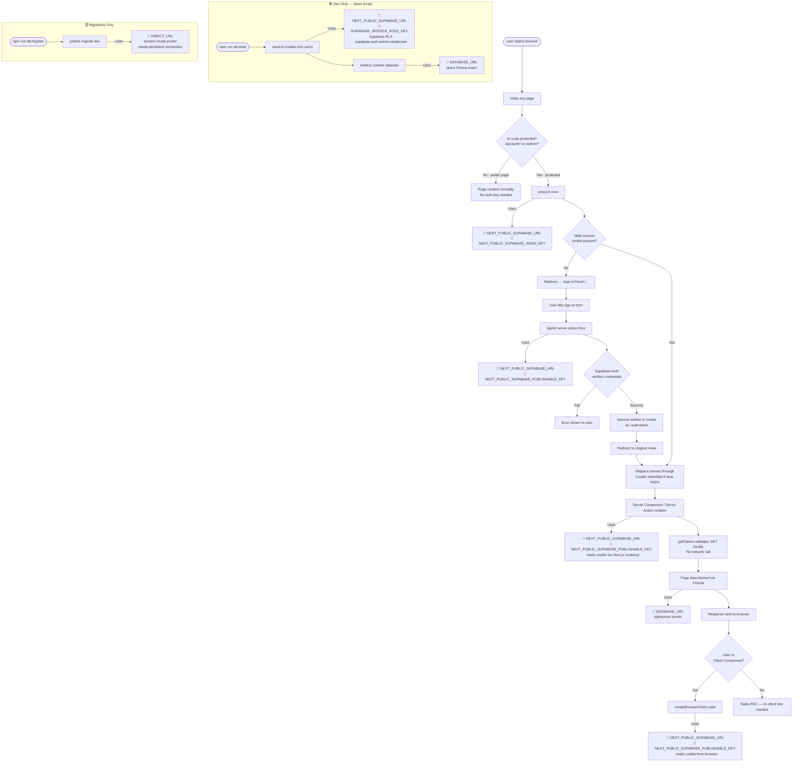

# Auth — Supabase SSR Session Management

> Last updated: 22 July 2026

---

## Overview

This project uses **Supabase Auth with `@supabase/ssr`** for authentication.
The session is stored in **HTTP cookies**, not localStorage or sessionStorage.
The `proxy.ts` file at the project root is responsible for reading, validating, and refreshing the session on every request.

Users can authenticate **two ways**, both handled by Supabase Auth:

1. **Email + password** with an **8-digit OTP code** for email confirmation and password reset (no magic links).
2. **Google** (social login / OAuth) — "Continue with Google".

---

## ⭐ Auth Setup From Scratch (Handover Guide)

> This section takes a brand-new environment (a fresh Supabase project) and makes
> **both** login methods work. It is split into two layers:
>
> - **Part A — Dashboard setup** (no coding — anyone can follow the clicks)
> - **Part B — How it works in the code** (for the developer)
>
> Do Part A once per environment (once for your dev Supabase project, once for
> prod). The code in Part B never changes between environments — only the
> dashboard values and env vars do.

### Part A — Dashboard setup (click-by-click)

#### A1. Create / open the Supabase project

1. Go to **https://supabase.com/dashboard** → **New project** (or open the existing one).
2. Note two values you'll need later (**Project Settings → API**):
   - **Project URL** → e.g. `https://errcihirsaoaochhkvbm.supabase.co` → env var `NEXT_PUBLIC_SUPABASE_URL`
   - **Publishable / anon key** (`sb_publishable_…` or the `anon` JWT) → env vars `NEXT_PUBLIC_SUPABASE_PUBLISHABLE_KEY` + `NEXT_PUBLIC_SUPABASE_ANON_KEY`
   - **Service role key** (secret, under "Project API keys") → env var `SUPABASE_SERVICE_ROLE_KEY` — **server/seed only, never ship to the browser.**
3. Get the **database connection strings** (**Project Settings → Database → Connection string**):
   - **Transaction pooler** (port `6543`) → `DATABASE_URL` (append `?pgbouncer=true`)
   - **Session pooler** (port `5432`) → `DIRECT_URL` (used only by `prisma migrate`)
   > ⚠️ If the DB password contains special characters (`@ : / ? # %`), **URL-encode them** in the connection string (e.g. `@` → `%40`). An un-encoded `@` in the password can be mis-parsed as the host separator.

#### A2. Turn on Email login + the OTP code flow

1. **Authentication → Providers → Email** → make sure **Email** is enabled and **"Confirm email"** is **ON** (this is what forces a verification code on signup).
2. **Authentication → Emails → SMTP Settings** → configure **custom SMTP**. This is **required**, not optional — Supabase's built-in mailer is rate-limited, only emails org members, and **won't let you edit the templates**. Full example (Resend) with troubleshooting lives in **[environment-setup.md → Supabase Auth Emails](environment-setup.md)**.
3. **Authentication → Emails → Templates** → in **"Confirm signup"** and **"Reset Password"**, put the token in the body so the email carries the **code** instead of a link:
   ```html
   <h2>Your verification code</h2>
   <h1>{{ .Token }}</h1>
   ```
   > Without `{{ .Token }}` the email is a magic-link and the 8 OTP boxes in the UI can never be satisfied.
4. **Authentication → URL Configuration**:
   - **Site URL:** `http://localhost:3000` (dev) / `https://yourdomain.com` (prod)
   - **Redirect URLs:** add `http://localhost:3000/**` (dev) / `https://yourdomain.com/**` (prod). The `/**` wildcard lets the OAuth callback (`/auth/callback`) resolve.

#### A3. Google OAuth — get a Client ID + Secret and wire it into Supabase

This is the part that isn't obvious. There are **three** places involved: Google Cloud Console (issues the credentials), the Supabase dashboard (stores them), and your app's redirect URLs.

**Step 1 — Google Cloud Console: create the OAuth credentials**

1. Go to **https://console.cloud.google.com** → create or select a **project** (top bar).
2. **APIs & Services → OAuth consent screen**:
   - **User type: External** → Create.
   - Fill **App name**, **User support email**, **Developer contact email**.
   - **Scopes:** add `.../auth/userinfo.email`, `.../auth/userinfo.profile`, and `openid` (these are the defaults Google offers — email + profile is all we need).
   - While the app is in **"Testing"** mode, only **Test users** you list here can sign in. Add your own email as a test user, or click **Publish app** to allow anyone.
3. **APIs & Services → Credentials → Create Credentials → OAuth client ID**:
   - **Application type: Web application.**
   - **Name:** anything (e.g. "Macgence Marketplace Web").
   - **Authorized JavaScript origins:** `http://localhost:3000` and `https://yourdomain.com`.
   - **Authorized redirect URIs — this is the critical one.** Put the **Supabase** callback here, NOT your app's URL:
     ```
     https://<YOUR-PROJECT-REF>.supabase.co/auth/v1/callback
     ```
     e.g. `https://errcihirsaoaochhkvbm.supabase.co/auth/v1/callback`.
     > 🔑 The single most common mistake: people put `http://localhost:3000/auth/callback` here. That's wrong. Google must redirect to **Supabase** first; Supabase then redirects to your app. Get the exact URL from the next step (Supabase shows it to you).
   - Click **Create** → copy the **Client ID** and **Client Secret**.

**Step 2 — Supabase: enable the Google provider**

1. **Authentication → Providers → Google** → toggle **Enable**.
2. Paste the **Client ID** and **Client Secret** from Step 1.
3. Supabase displays the exact **"Callback URL (for OAuth)"** on this same screen — copy it and confirm it matches what you pasted into Google's *Authorized redirect URIs* in Step 1. They must be identical.
4. **Save.**

**Step 3 — confirm the app redirect allow-list**

Make sure `http://localhost:3000/**` (and the prod URL) are in **Authentication → URL Configuration → Redirect URLs** (from A2.4) — the app tells Supabase to bounce the finished session back to `/auth/callback`, and that destination has to be allow-listed.

> **Per-environment reminder:** dev and prod are **separate** Supabase projects and **separate** Google OAuth clients. Do A3 twice — once with `localhost` URLs against your dev project, once with the real domain against prod.

### Part B — How it works in the code (developer)

Nothing above requires code changes — the wiring already exists. Here's the full round-trip so you can debug it:

```
1. User clicks "Continue with Google"  (sign-in-form.tsx / sign-up-form.tsx)
     supabase.auth.signInWithOAuth({
       provider: 'google',
       options: { redirectTo: `${window.location.origin}/auth/callback` },
     })
        ↓  browser is redirected to Google's consent screen
2. Google authenticates the user, then redirects to SUPABASE:
     https://<ref>.supabase.co/auth/v1/callback?code=...
        ↓  Supabase validates with Google using the stored Client ID/Secret
3. Supabase redirects back to OUR app (the `redirectTo` from step 1):
     http://localhost:3000/auth/callback?code=...
        ↓
4. src/app/auth/callback/route.ts (GET) runs:
     - reads ?code
     - supabase.auth.exchangeCodeForSession(code)  → sets the sb-<ref>-auth-token cookie
     - redirects to /  (now logged in; navbar updates via onAuthStateChange)
```

| Piece | File | Role |
|---|---|---|
| "Continue with Google" button + `signInWithOAuth` | `src/components/auth/sign-in-form.tsx`, `src/components/auth/sign-up-form.tsx` | Kicks off the OAuth redirect; `redirectTo` points at our callback |
| OAuth callback handler | `src/app/auth/callback/route.ts` | Exchanges the `?code` for a session cookie via `exchangeCodeForSession`, then redirects home. On missing/failed code it logs and redirects to `/` |
| Session cookie + everything after | `proxy.ts`, `server.ts`, `client.ts` | Identical to the password flow — once the cookie is set, Google users are indistinguishable from password users |

> **Why a `code` and not a token?** This is the PKCE / authorization-code flow. Supabase hands the browser a short-lived `code`; only the server-side callback route exchanges it for the real session, so the tokens never sit in a URL the browser history can leak.

**Common Google-login failures & what they mean**

| Symptom | Cause | Fix |
|---|---|---|
| `redirect_uri_mismatch` on Google's screen | The `Authorized redirect URI` in Google ≠ the Supabase callback URL | Copy the exact callback from Supabase → Providers → Google into Google Cloud → Credentials |
| Lands back on `/` still logged out | App's `/auth/callback` not in Supabase Redirect URLs, or `exchangeCodeForSession` failed | Add `http://localhost:3000/**` to URL Configuration; check server logs for `auth/callback: exchange failed` |
| `Error 403: access_denied` | App still in Google "Testing" mode and the user isn't a listed test user | Add them as a Test user, or Publish the consent screen |
| Works local, fails prod | Prod uses a different Supabase project / Google client that wasn't configured | Repeat Part A A3 for the prod project + domain |

---

## Why Cookies, Not localStorage?

When you log in, `@supabase/ssr` writes the session into a secure HTTP cookie named:

```
sb-<project-ref>-auth-token
```

You will **not** see anything in localStorage or sessionStorage — this is intentional.
The browser **automatically attaches cookies to every HTTP request**, so the server always receives the session without any manual forwarding.

To inspect the cookie: **DevTools → Application → Cookies** (not Storage).

---

## Session Flow — Step by Step

### 1. Login

```
User submits sign-in form
  ↓
signIn() server action calls supabase.auth.signInWithPassword()
  ↓
Supabase Auth verifies credentials → returns session:
  - access_token  (JWT, expires ~users1 hour)
  - refresh_token (long-lived, used to get a new access_token)
  ↓
@supabase/ssr writes these into HTTP cookies automatically
  ↓
Browser stores the cookie — sent automatically on every future request
```

### 2. Every Subsequent Request (any route)

```
Browser navigates to any page
  ↓
Browser automatically attaches sb-<ref>-auth-token cookie to the request
  ↓
proxy.ts runs FIRST (before any page renders)
  ↓
  ├── Reads the auth cookie from the incoming request
  ├── Validates / refreshes the JWT
  ├── If protected route + no valid session → redirect to /login?next=...
  └── If valid → passes through, writes refreshed cookie back to response
  ↓
Page / Server Component renders
  ↓
server.ts createClient() reads the same cookie via Next.js cookies() API
  ↓
Any server action or RSC can call supabase.auth.getClaims() or getUser()
to get the current user — no extra DB call needed
```

---

## The Two Supabase Clients

Two separate clients are used — they do different jobs and must never be mixed up.

| Client | File | Runs in | How it reads the session |
|---|---|---|---|
| **Browser client** | `src/lib/supabse/client.ts` → `createBrowserClient` | Client Components (`"use client"`) | Reads the cookie directly from the browser |
| **Server client** | `src/lib/supabse/server.ts` → `createServerClient` | Server Components, Server Actions, Route Handlers | Reads the cookie via Next.js `cookies()` API |

### Browser Client (`client.ts`)

```ts
import { createBrowserClient } from "@supabase/ssr";

export const createClient = () =>
  createBrowserClient(
    process.env.NEXT_PUBLIC_SUPABASE_URL!,
    process.env.NEXT_PUBLIC_SUPABASE_PUBLISHABLE_KEY!,
  );
```

- Uses a **singleton pattern** internally — safe to call multiple times, only one instance is created.
- Use in any `"use client"` component (e.g. a hook, an interactive form).

### Server Client (`server.ts`)

```ts
import { createServerClient } from "@supabase/ssr";
import { cookies } from "next/headers";

export const createClient = (cookieStore: Awaited<ReturnType<typeof cookies>>) => {
  return createServerClient(
    process.env.NEXT_PUBLIC_SUPABASE_URL!,
    process.env.NEXT_PUBLIC_SUPABASE_PUBLISHABLE_KEY!,
    {
      cookies: {
        getAll() {
          return cookieStore.getAll()  // reads session from incoming request cookies
        },
        setAll(cookiesToSet) {
          try {
            cookiesToSet.forEach(({ name, value, options }) =>
              cookieStore.set(name, value, options)
            )
          } catch {
            // Called from a Server Component — safe to ignore.
            // proxy.ts handles writing cookies on every request.
          }
        },
      },
    },
  );
};
```

- Must be created **fresh on every server request** — it wraps the incoming request's cookies.
- The `try/catch` on `setAll` is intentional: Server Components can't write cookies, but `proxy.ts` handles all cookie writes before the component even runs.

---

## The Proxy (`proxy.ts`)

The Proxy is a Next.js concept (formerly called "middleware"). It runs **before every matched request** and is responsible for:

1. Refreshing the auth token when it's near expiry
2. Writing the refreshed token back into the response cookies (so the browser stays up-to-date)
3. Protecting routes — redirecting unauthenticated users to `/login?next=...`

```ts
// proxy.ts (root of project)
import { createServerClient } from '@supabase/ssr'
import { NextResponse, type NextRequest } from 'next/server'

export async function proxy(request: NextRequest) {
  let supabaseResponse = NextResponse.next({ request })

  const supabase = createServerClient(
    process.env.NEXT_PUBLIC_SUPABASE_URL!,
    process.env.NEXT_PUBLIC_SUPABASE_ANON_KEY!,
    {
      cookies: {
        getAll: () => request.cookies.getAll(),
        setAll: (cookiesToSet) => {
          cookiesToSet.forEach(({ name, value, options }) =>
            supabaseResponse.cookies.set(name, value, options)
          )
        },
      },
    }
  )

  // getClaims() verifies the JWT locally (no network call) and still refreshes
  // the session cookie when the token is near expiry — same as getUser() did.
  const { data } = await supabase.auth.getClaims()
  const isAuthenticated = !!data?.claims

  const isProtected =
    request.nextUrl.pathname.startsWith('/account') ||
    request.nextUrl.pathname.startsWith('/admin')

  if (isProtected && !isAuthenticated) {
    const url = request.nextUrl.clone()
    url.pathname = '/login'
    url.searchParams.set('next', request.nextUrl.pathname)
    return NextResponse.redirect(url)
  }

  return supabaseResponse
}

export const config = {
  matcher: ['/account/:path*', '/admin/:path*'],
}
```

> **Note:** The file is named `proxy.ts` (not `middleware.ts`) — this matches the current Supabase SSR documentation which refers to this layer as the "Proxy".

---

## Three Auth Methods — Which to Use

The latest Supabase docs (June 2026) define three methods. Choosing the wrong one is a common mistake.

| Method | What it does | Network call? | Use for |
|---|---|---|---|
| `getClaims()` | Validates JWT signature locally via WebCrypto + cached JWKS | ❌ No | **Protecting pages and reading user identity** — fastest, recommended |
| `getUser()` | Makes a live call to the Supabase Auth server for the latest user record | ✅ Yes | When you need the absolute freshest user data (e.g. after profile update) |
| `getSession()` | Returns the raw session (access_token, refresh_token) from storage — does **not** re-validate | ❌ No | Forwarding the access token to another service — **never use for auth checks** |

### Rule of thumb

```
Protecting a page or checking who's logged in  →  getClaims()
Need latest user data from the DB              →  getUser()
Need the raw token to forward elsewhere        →  getSession()
Never use getSession() for authorization       →  ❌ always leads to security issues
```

### `getClaims()` — How It Works Internally

```
supabase.auth.getClaims()
  ↓
Reads the access_token from the cookie
  ↓
Verifies JWT signature locally using WebCrypto API
  +  cached JWKS endpoint (project's public keys)
  ↓
Returns the decoded claims (user id, email, role, expiry, etc.)
  ↓
No network call to Supabase — runs entirely on your server
```

This is **faster and cheaper** than `getUser()` for every request. The token's signature cannot be forged, so it's safe to trust for identity checks.

### `getUser()` — When to Actually Use It

```ts
// Example: after the user updates their profile, confirm the change
const { data: { user } } = await supabase.auth.getUser()
// user.email, user.user_metadata, etc. are guaranteed fresh from Auth server
```

Use sparingly — it adds a network roundtrip to every call.

### Where Each Method Is Used in This Codebase

| Layer | Method | File |
|---|---|---|
| Server-side auth checks (route handlers, server actions) | `getClaims()` | `src/services/auth.service.ts` |
| Proxy route guard + session refresh | `getClaims()` | `proxy.ts` |

All server-side authorization goes through one shared helper — **`src/services/auth.service.ts`**:

| Function | Returns | Use for |
|---|---|---|
| `getSessionUserId(cookieStore)` | `string \| null` (the JWT `sub`) | Just need "is there a valid session + who" |
| `getSessionUser(cookieStore)` | `{ id, email, role } \| null` | Need the app **role** for a role check (role is read from the DB, not the JWT) |

> **Why the role comes from the DB:** the `role` claim inside the JWT is the *Postgres* role (always `authenticated`), **not** our app role (`user` / `seller` / `admin`). So `getSessionUser` verifies identity from the token via `getClaims()`, then reads the app role from the `users` row.

Consumers today: `POST /api/v1/datasets` (seller/admin only) and `uploadDatasetFilesAction` (seller/admin only).

> **Note on the proxy:** `proxy.ts` uses `getClaims()` to gate `/account/*` and `/admin/*`. `getClaims()` still refreshes the session cookie when the token is near expiry (the key side effect this middleware needs), so the swap from `getUser()` keeps that behavior while dropping the per-request network call. The proxy only checks that a session is *valid* — it does not read the app role (role checks happen in the route/action layer via `getSessionUser`).

---

## Auth UI — Modal, Not Routes

Auth is **not** a set of dedicated routes. There are no `/sign-in`, `/sign-up`,
`/forgot-password`, or `/reset-password` pages. Instead the forms open as an
**overlay on whatever route the user is currently on**, and after a successful
action the modal closes and the user stays exactly where they were.

The session itself is **never** held in this state — it lives in the auth
cookie and is read server-side via `getClaims()` on every request. The store is
purely the modal's open/closed UI state. Following the tech-stack rule (Zustand
for UI-only state, no provider needed), it's a Zustand store, not a context:

| Concern | File | Purpose |
|---|---|---|
| State | `src/stores/auth-modal.store.ts` | Zustand `useAuthModal()` store: `{ view, open, close }`. No provider, no Supabase logic — UI state only. `open('sign-in' \| 'sign-up' \| 'forgot-password')`. |
| UI — shell | `src/components/auth/auth-modal.tsx` | Light split-screen card (860×600, 12px radius, backdrop `bg-black/65`, Esc/backdrop to close), rendered once in the root layout next to `{children}`. Provides the shared side panel; each form renders only its right-side content. |
| UI — side panel | `src/components/auth/auth-side-panel.tsx` | The blue marketing panel (`#1A2552`) shared by all three views. |
| UI — forms | `src/components/auth/{sign-in,sign-up,forgot-password}-form.tsx` | Built with **React Hook Form + zodResolver** (see tech-stack-decisions.md); switch views via `useAuthModal`. |
| UI — triggers | `src/components/auth/auth-nav-buttons.tsx` | Navbar Sign In / Get Started buttons that `open()` the modal. |

`src/components/auth/index.ts` re-exports the UI (`AuthModal`, `AuthNavButtons`).
The only React client provider mounted app-wide is TanStack Query's, in
`src/app/providers.tsx` (`Providers`) — see docs/tech-stack-decisions.md.

### Sign-up — 3 steps (one component, internal `step` state)

`sign-up-form.tsx` walks through:

1. **Credentials** — email + password (RHF + `signUpSchema`; password rule "Use
   8+ characters and one number", with a live strength hint). `signUp()` emails an
   8-digit confirmation code.
2. **Email OTP** — "Check your inbox" with 8 code input boxes + resend countdown.
   `verifySignupOtp(email, token)` validates against `signupOtpSchema` (`/^\d{8}$/`) and calls `verifyOtp({ type: 'signup' })`.
3. **Profile setup (skippable)** — Full Name / Organization / Industry / Role (`profileSchema`
   + `updateProfile()`). All optional; `fullName` falls back to the email prefix server-side when left blank.

> The `users` row is created by the Supabase `handle_new_user` trigger on signup;
> `updateProfile` updates it. See the trigger / `updated_at` caveat in db-schema.md.

### Email delivery (OTP) requires custom SMTP

All the OTP flows depend on Supabase **custom SMTP** + `{{ .Token }}` in the
**Confirm signup** and **Reset password** templates. Built-in email can't edit
templates and is rate-limited. Full setup (Resend example, troubleshooting) is in
**docs/environment-setup.md → Supabase Auth Emails**.

### Password reset — OTP, not a link

There is **no** reset-password page or recovery link. Reset is a two-step OTP
flow inside the forgot-password form:

1. **Step 1 — email.** `forgotPassword(email)` validates via `forgotPasswordSchema` and calls `resetPasswordForEmail()`
   with **no `redirectTo`**, so Supabase emails the recovery `{{ .Token }}`
   (an 8-digit code) instead of a magic link.
2. **Step 2 — code + new password.** `verifyPasswordResetOtp(email, token,
   newPassword)` validates via `verifyResetOtpSchema` (`/^\d{8}$/`), calls `verifyOtp({ type: 'recovery' })` (establishes a session
   in the cookie) then `updateUser({ password })`. The form closes in place.

> ⚠️ The recovery email template must include `{{ .Token }}` for the code to
> appear — **Supabase Auth → Email Templates → Reset Password**. (No Redirect
> URL config is needed, since there's no link to follow.)

### Server Actions (`src/actions/auth.actions.ts`)

| Action | Validation Schema | What it does |
|---|---|---|
| `signUp(email, password)` | `signUpSchema` | Registers via Supabase Auth, emails an 8-digit confirmation code, returns `{ success }` |
| `verifySignupOtp(email, token)` | `signupOtpSchema` | `verifyOtp({ type: 'signup' })`; best-effort backfills `fullName` from the email prefix |
| `updateProfile({ fullName, organization, industry, jobTitle })` | `profileSchema` | Updates the current user's `users` row (profile step); blank `fullName` → email prefix |
| `signIn(email, password)` | `signInSchema` | Signs in via password, returns `{ success }` — **no redirect**, the modal closes in place |
| `signOut()` | N/A | Signs out, clears cookie, redirects to `/` |
| `forgotPassword(email)` | `forgotPasswordSchema` | Emails an 8-digit recovery code via `resetPasswordForEmail()` (no redirect) |
| `verifyPasswordResetOtp(email, token, newPassword)` | `verifyResetOtpSchema` | `verifyOtp({ type: 'recovery' })` + `updateUser()`, returns `{ success }` — **no redirect** |

---

## Protected Routes

The proxy currently guards these route prefixes:

```
/account/*   →  redirect to /login?next=/account/... if no session
/admin/*     →  redirect to /login?next=/admin/... if no session
```

When more protected routes are added (e.g. `/profile/*`), add them to the `matcher` in `proxy.ts` and add a corresponding `isProtected` check. am gonna update it 


---

## Role System

Roles are stored as a `text` field on the `users` table — three values:

| Role | Access |
|---|---|
| `user` | Standard buyer — orders, downloads, issues |
| `seller` | Dataset management, meet slot hosting, revenue dashboard |
| `admin` | Full access — all users, all datasets, analytics, issues |

Role is checked in profile pages and API routes, **not** enforced by the Proxy (the Proxy only checks whether a session exists, not what role it is).

---

## Environment Variables — Complete Reference

### All Keys and Their Purpose

| Variable | Visible to Browser? | Used By | Purpose |
|---|---|---|---|
| `NEXT_PUBLIC_SUPABASE_URL` | ✅ Yes | `client.ts`, `server.ts`, `proxy.ts`, seed | Supabase project endpoint — the base URL for all Supabase API calls |
| `NEXT_PUBLIC_SUPABASE_PUBLISHABLE_KEY` | ✅ Yes | `client.ts`, `server.ts` | Safe public key for browser + server auth — enables sign in/up, session read |
| `NEXT_PUBLIC_SUPABASE_ANON_KEY` | ✅ Yes | `proxy.ts` | Anon key used in the Proxy — functionally same as publishable key; **standardise to one name** |
| `DATABASE_URL` | ❌ Server only | `prisma.ts` (runtime) | Postgres via **pgbouncer transaction-mode pooler** — used for all runtime DB queries (`findMany`, `create`, etc.) |
| `DIRECT_URL` | ❌ Server only | `prisma.config.ts` (migrations) | Postgres via **session-mode pooler** — used by `prisma migrate` only (migrations need a persistent connection) |
| `NEXT_PUBLIC_APP_URL` | ✅ Yes | `auth.actions.ts` | Base URL of the app — appended to password reset redirect link sent in email |
| `SUPABASE_SERVICE_ROLE_KEY` | ❌ Server only | `prisma/seed.ts` only | **Admin-level key that bypasses RLS** — used in seed to create auth users via `supabase.auth.admin.*`. Never expose to browser. Never import in `src/`. |

---

### Security Boundary

```
┌─────────────────────────────────────────────────────────┐
│  BROWSER-SAFE  (NEXT_PUBLIC_* prefix)                   │
│                                                          │
│  NEXT_PUBLIC_SUPABASE_URL                               │
│  NEXT_PUBLIC_SUPABASE_PUBLISHABLE_KEY                   │
│  NEXT_PUBLIC_SUPABASE_ANON_KEY                          │
│  NEXT_PUBLIC_APP_URL                                    │
└─────────────────────────────────────────────────────────┘

┌─────────────────────────────────────────────────────────┐
│  SERVER-ONLY  (no NEXT_PUBLIC_ prefix)                  │
│                                                          │
│  DATABASE_URL           → Prisma runtime queries        │
│  DIRECT_URL             → Prisma migrations only        │
│  SUPABASE_SERVICE_ROLE_KEY → seed only, bypasses RLS   │
└─────────────────────────────────────────────────────────┘
```

> ⚠️ **`SUPABASE_SERVICE_ROLE_KEY` must NEVER appear in any `src/` file.** It bypasses all Row-Level Security policies — if leaked to the browser, any user can read/write any row in the DB.

---

### Which Key is Active — User Interaction Flowchart



---

### Key-by-Key Interaction Summary

#### `NEXT_PUBLIC_SUPABASE_URL`
- **When active:** Every single Supabase call — browser, server, proxy, seed
- **Who uses it:** `client.ts`, `server.ts`, `proxy.ts`, `prisma/seed.ts`
- **What happens without it:** All Supabase calls fail immediately — app is completely broken

#### `NEXT_PUBLIC_SUPABASE_PUBLISHABLE_KEY`
- **When active:** Sign-in, sign-up, forgot password, reset password, any server action reading the session, any client component calling Supabase
- **Who uses it:** `client.ts` (browser), `server.ts` (SSR)
- **What happens without it:** Auth forms fail, server components can't read the session

#### `NEXT_PUBLIC_SUPABASE_ANON_KEY`
- **When active:** Every HTTP request that hits a protected route (`/account/*`, `/admin/*`)
- **Who uses it:** `proxy.ts` only
- **What happens without it:** Proxy can't validate sessions — protected routes break
- **⚠ Standardise:** This and `PUBLISHABLE_KEY` should be the same value. Pick one name and update `proxy.ts` to use `NEXT_PUBLIC_SUPABASE_PUBLISHABLE_KEY`

#### `DATABASE_URL`
- **When active:** Any Prisma query at runtime — `findMany`, `create`, `update`, `delete`
- **Who uses it:** `src/lib/prisma.ts` (singleton used by all services)
- **What happens without it:** All DB queries fail — datasets page, profile, everything breaks
- **Note:** Uses pgbouncer transaction-mode — compatible with Prisma's pooled queries

#### `DIRECT_URL`
- **When active:** Only when running `npm run db:migrate` or `npm run db:push`
- **Who uses it:** `prisma.config.ts` datasource
- **What happens without it:** Migrations fail (session-mode pooler required for DDL statements)
- **Never needed at runtime** — not used by the app server

#### `NEXT_PUBLIC_APP_URL`
- **When active:** When user clicks "Forgot Password" → `forgotPassword()` server action
- **Who uses it:** `src/actions/auth.actions.ts` — appended as `redirectTo` in the reset email
- **What happens without it:** Password reset emails send but the link points to `undefined/reset-password` — broken reset flow 

#### `SUPABASE_SERVICE_ROLE_KEY`
- **When active:** Only during `npm run db:seed` — never at runtime
- **Who uses it:** `prisma/seed.ts` → `supabase.auth.admin.createUser()`
- **What it does:** Bypasses all RLS policies — can read/write any row, create any auth user
- **What happens without it:** Seed script fails — `supabaseKey is required` error
- **Security rule:** Must never appear in any file inside `src/`. Dev/seed use only.
